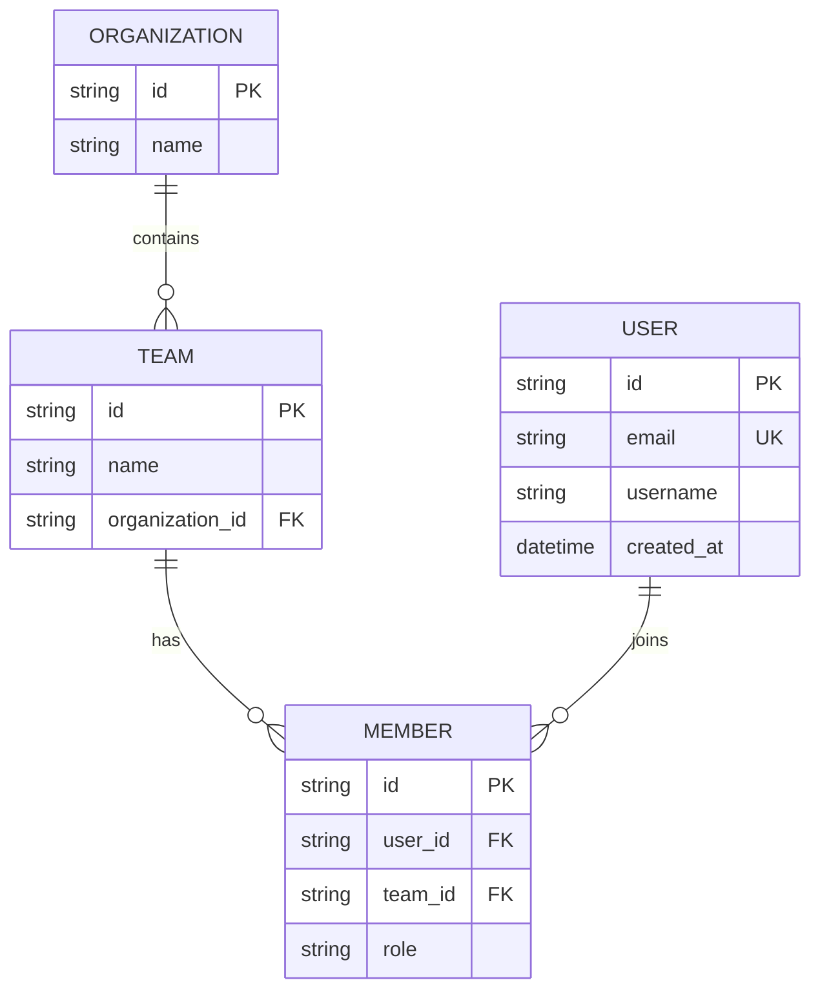

# Entity E/R Diagram Generator

Generate a Mermaid E/R diagram from entity definitions found in source files and save it to a documentation file chosen by the user.

## Step 1: Gather Locations

Before scanning any files, determine the two required paths. Ask the user if they are not provided upfront.

**Entity source directory** — where are the entity/model files?
- If not specified, search the workspace for common patterns: files named `*.entity.ts`, `*Entity.ts`, `*Model.ts`, `*Schema.ts`, or directories named `entity/`, `entities/`, `models/`, `domain/`
- Show the candidates found and ask the user to confirm which to use

**Output file path** — where should the diagram be saved?
- Do NOT assume or default to any path
- Ask the user explicitly: *"Where would you like to save the diagram? (e.g. `docs/entity-diagram.md`)"*
- Accept any path the user provides

## Step 2: Evaluate Existing Diagram

If a file already exists at the confirmed output path:
- Read and analyze it
- Preserve any manual improvements or customizations
- Identify what needs updating based on current entity files
- Merge new entities/fields while keeping the existing layout intact

## Step 3: Extract Entity Information

Read entity files from the confirmed source directory. Extract:
- Entity names
- Fields with their types
- Primary keys → mark `PK`
- Foreign keys (fields ending in `_id`, `Id`, or referencing another entity) → mark `FK`
- Unique keys → mark `UK`
- Relationships between entities (1:1, 1:N, N:M)
- Value objects referenced by entities (if applicable)

## Step 4: Generate the Mermaid Diagram

Produce a **Mermaid erDiagram** block with:
1. All entities with attributes embedded using `{}` syntax
2. Type, PK/FK/UK markers on each attribute
3. Relationships with correct cardinality labels

**Cardinality notation:**

| Notation | Meaning |
|----------|---------|
| `\|\|` | exactly one |
| `\|o` | zero or one |
| `o{` / `}o` | zero or more |
| `\|{` / `{\|` | one or more |

Example output:

## Step 5: Save the Result

Save the diagram to the user-confirmed output path using the [output template](references/template.md).

Keep the output concise: only the diagram block and a short notes section for anything not captured visually (e.g. validation rules, computed fields).

After saving, confirm the file was written and show a preview of the diagram.
